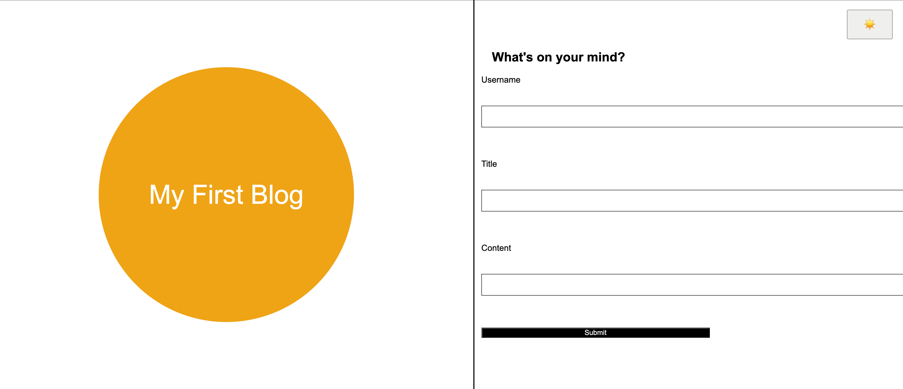

# my-blog

## Discription

The purspose of this project is to create a blog landing page.  Once items are typed in the input boxes and the submit button is clicked, we are redirected to another
page showing us the blog posts. 

* Input items should be stored and the localStorage and the display on the next page. 
* The buttons on landing page should let us toggle dark/light modes and submit content.
* The buttons on the blog page should let us toggle dark/light mode and take us to previous page. 

## Installation

Website:

https://jguzman87.github.io/my-blog/

## Contact Information

Jorge Guzman
jguzman913@gmail.com
